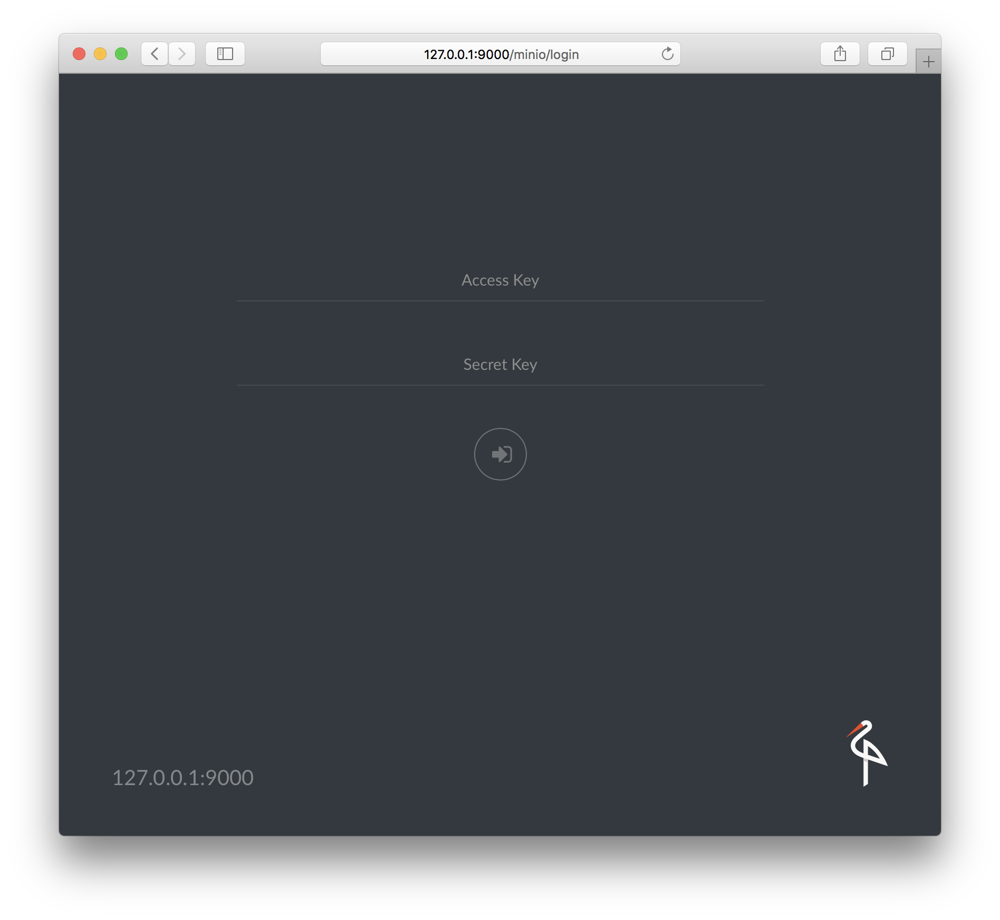
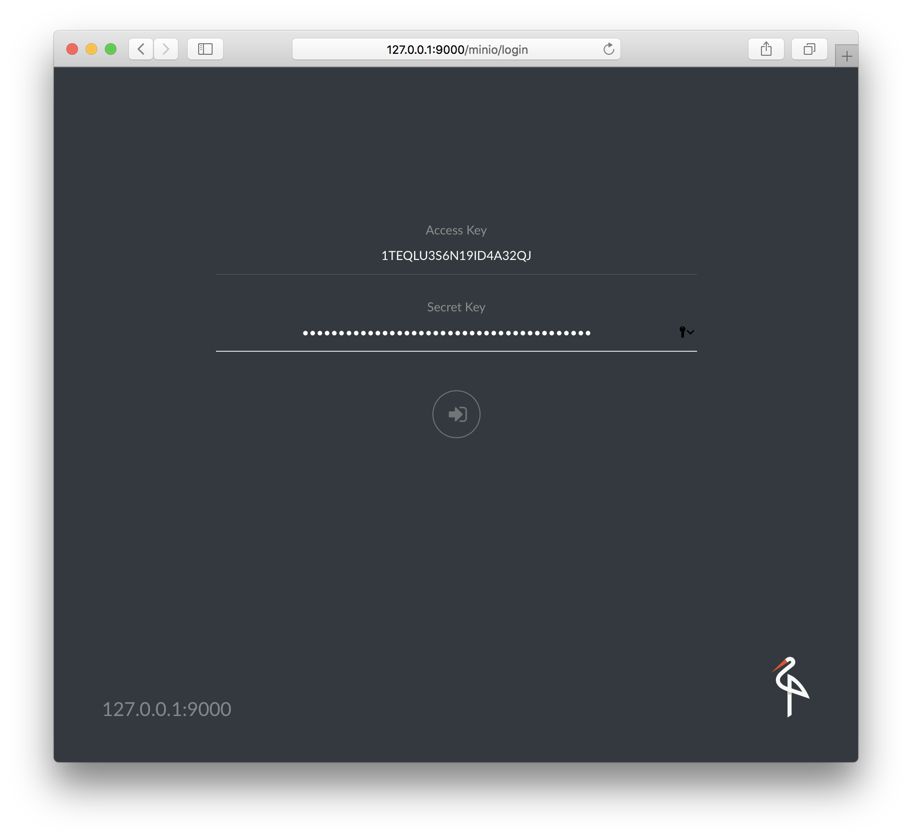
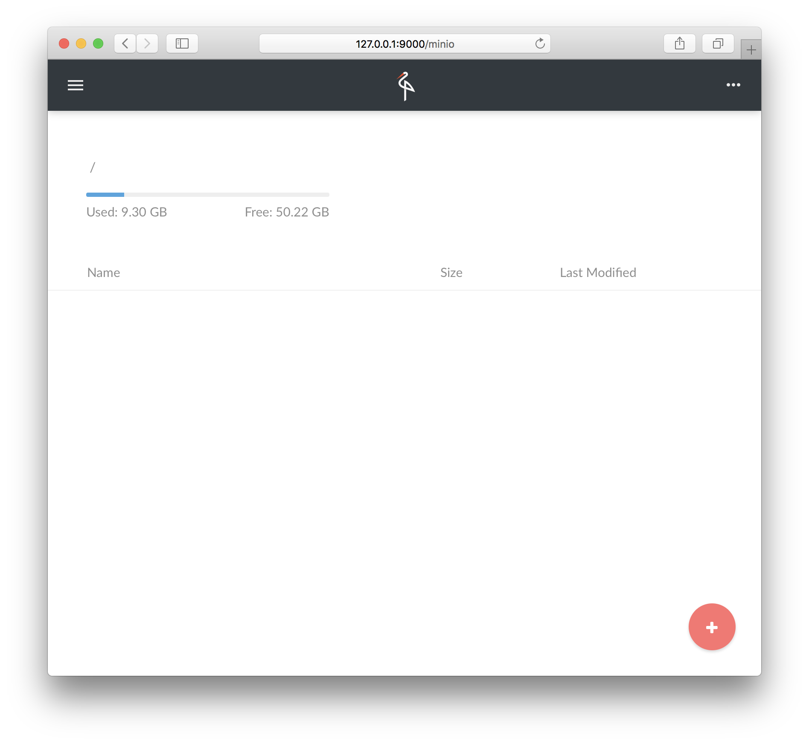

<center>
<a href="https://vaadin.com">
 </a>
</center>

# How to connect a Vaadin App to a S3 Storage
How to use Vaadin together with a Amazon S3 Compatible Cloud Storage 

For the impatient: the corresponding 
github repo ist here [https://github.com/Java-Publications/vaadin-027-S3-storage-minio](https://github.com/Java-Publications/vaadin-027-S3-storage-minio)

## Demo-App
The demo App is a blob - storage based on the minio storage and the Vaadin Framework
App to present the blobs. 


Some ideas what you could additionally do:

### Raspberry Pi - Cam
Raspberry Pi will take images, triggered by TinkerForge Motion Sensor or time based. 
The pics are stored inside the Minio Storage. 
Vaadin will give you a image gallery.

### Issuetracker
Every Issue is a bucket, contains als information's and screenshots.

### much more
be creative ;-)


## S3 Storage - Minio
The project we are using here is on github [https://github.com/minio/minio](https://github.com/minio/minio)
With this we can start building a document storage for our Vaadin Apps.

from the minio page itself : 
>It is best suited for storing unstructured data such 
as photos, videos, log files, backups and container / VM images. 
Size of an object can range from a few KBs to a maximum of 5TB.

But first, I will show how to start with the 
S3 Storage itself.
For this example we have to install Docker and Docker-Compose. 
The docker installation itself is out of the scope of this
article. After you have done this, we could start 
polling the image with the docker command. ```docker pull minio/minio```

Now we can start using this. For the first examples 
I would create a container without external volume, every data will 
be lost after the container is stopped and deleted.
For the first steps, this is perfect ;-)

```docker run -p 9000:9000 --name minio minio/minio server /data```

But if you want/need persistent volumes, up to 16 volumes per 
minio node can be used.

``` 
docker run -p 9000:9000 --name minio \
  -v /mnt/data1:/data1 \
  -v /mnt/data2:/data2 \
  -v /mnt/data3:/data3 \
  -v /mnt/data4:/data4 \
  -v /mnt/data5:/data5 \
  -v /mnt/data6:/data6 \
  -v /mnt/data7:/data7 \
  -v /mnt/data8:/data8 \
  minio/minio server /data1 /data2 /data3 /data4 /data5 /data6 /data7 /data8
```

After the first start (in this example I just used the first version)
you will get the information about the node via the logs.

```
Drive Capacity: 50 GiB Free, 60 GiB Total

Endpoint:  http://172.17.0.2:9000  http://127.0.0.1:9000
AccessKey: 1TEQLU3S6N19ID4A32QJ 
SecretKey: KQamn/OWyGZPnuGq+1ZNYgRZqJLeiAJ06bJwNmJ9 

Browser Access:
   http://172.17.0.2:9000  http://127.0.0.1:9000

Command-line Access: https://docs.minio.io/docs/minio-client-quickstart-guide
   $ mc config host add myminio http://172.17.0.2:9000 1TEQLU3S6N19ID4A32QJ KQamn/OWyGZPnuGq+1ZNYgRZqJLeiAJ06bJwNmJ9

Object API (Amazon S3 compatible):
   Go:         https://docs.minio.io/docs/golang-client-quickstart-guide
   Java:       https://docs.minio.io/docs/java-client-quickstart-guide
   Python:     https://docs.minio.io/docs/python-client-quickstart-guide
   JavaScript: https://docs.minio.io/docs/javascript-client-quickstart-guide
   .NET:       https://docs.minio.io/docs/dotnet-client-quickstart-guide
```

Important are the following information's

* Endpoint:  http://172.17.0.2:9000  http://127.0.0.1:9000
* AccessKey: 1TEQLU3S6N19ID4A32QJ 
* SecretKey: KQamn/OWyGZPnuGq+1ZNYgRZqJLeiAJ06bJwNmJ9
 
With this you can start, using the node that was just created.
Use a web browser and access the following url:  **http://127.0.0.1:9000**



For the first login, use the **AccessKey** and **SecretKey** that was created
by the minio server itself.



After the first login, there will be a more or less empty screen.


Now we have all preparations done time to start with the Java-side as well.

## S3 Storage - Minio - Java-SDK
The Java SDK is provided at maven central. 

```xml
<dependency>
    <groupId>io.minio</groupId>
    <artifactId>minio</artifactId>
    <version>3.0.12</version>
</dependency>
```

The SDK will give you a class called **MinioClient**. With this all commands are 
operated on the S3-Storage. To initialize the client, you need the information's 
from the log of your minio-container.

```java
      final MinioClient minioClient = new MinioClient(
                                       "https://localhost:9000", 
                                       "1TEQLU3S6N19ID4A32QJ", 
                                       "KQamn/OWyGZPnuGq+1ZNYgRZqJLeiAJ06bJwNmJ9");
```

Now we can play around with the api itself. 
Check the class ```MinioBasicTest``` in the project for more code examples.


## S3 Storage - Minio - with Docker Compose
Minio itself can be started in a distributed version. To show this, I created a docker-compose file
under **_data/** that will create a four node cluster of 
minio.
The Access- and Sec-Key is set to minio/minio123. 
You will find this information inside the docker-compose file.
For production you MUST change this.

In front of this cluster, there is a proxy server with easy 
load balancing based on nginx. The proxy itself is listening 
on localhost port 9999.

## The Vaadin App

Now we are ready to start with the Vaadin App itself.
This version is based on Vaadin 8.
The functionality is quite easy. 
After providing the credentials for the S3 storage 
the app will oad randomly a picture every few seconds from the storage and 
present it on the screen.


### Vaadin rampup
The ramp up of the Vaadin app is done in the class ```CoreUIService```. Here you will see, that this example is using 
a core undertow to provide the Vaadin app.
To connect to the UI class, the System-Property 

**public static final String COMPONENT_SUPPLIER_TO_USE = "COMPONENT_SUPPLIER_TO_USE";**
must be set with the class name that will provide the ```Supplier<Component>```.
This Supplier is used to create the ContentRoot - Element.


```Java
public class JumpstartUI extends CoreUIService implements HasLogger {

  static {
    setProperty(COMPONENT_SUPPLIER_TO_USE, MySupplier.class.getName());
  }

  public static class MySupplier implements CoreUIService.ComponentSupplier {
    @Override
    public Component get() {
      return new DashboardComponent().postConstruct();
    }
  }
}
```

The Basic UI is implemented inside the class ```DashboardComponent```.

```java
  private final TextField accessPoint = new TextField("Access point");
  private final TextField accessKey   = new TextField("accessKey");
  private final TextField secKey      = new TextField("secKey");
  private final TextField bucketName  = new TextField("bucketName");
  private final Button    connect     = new Button("connect");

  private final FormLayout layout = new FormLayout(accessPoint,
                                                   accessKey,
                                                   secKey,
                                                   bucketName,
                                                   connect
  );

  private Image  image      = new Image();
  private Layout mainLayout = new VerticalLayout(layout, image);


  public DashboardComponent() {
    setCompositionRoot(mainLayout);
  }
```

Now we need the connection to the S3 storage.
Check the class ```MinioClientFunctions```, here you will find a functional wrapper 
around the MinioClient class. Why?
Well, the MinioClient is throwing a lot of exceptions, that will lead to ugly code if 
you want to avoid a global try-catch-block or nested try-catch-blocks.


>Additionally I am using the tiny frp lib that you can find on github
>[https://github.com/functional-reactive/functional-reactive-lib](https://github.com/functional-reactive/functional-reactive-lib)


#### creating an MinioClient instance
```java
  static CheckedFunction<Coordinates, MinioClient> client() {
    return (coord) -> new MinioClient(coord.endpoint(),
                                      coord.accessKey(),
                                      coord.secretKey()
    );
  }
```
#### create a bucket if not already exists

```java
  static CheckedBiFunction<MinioClient, String, MinioClient> bucket() {
    return (minioClient, bucketName) -> {
      if (!minioClient.bucketExists(bucketName)) {
        minioClient.makeBucket(bucketName);
      }
      return minioClient;
    };
  }
``` 

#### put Object to bucket

```java
  static CheckedBiFunction<MinioClient, Blob, MinioClient> putObj() {
    return (minioClient, obj) -> {
      minioClient.putObject(obj.getT1(),
                            obj.getT2(),
                            obj.getT3(),
                            obj.getT4()
      );
      return minioClient;
    };
  }
```

#### get Object from bucket

```java
  static CheckedBiFunction<MinioClient, BlobCoordinates, InputStream> getObj() {
    return (minioClient, obj) -> minioClient
        .getObject(
            obj.bucketName(),
            obj.objectName()
        );
  }
```

### from S3 to Vaadin
With this we can finally connect the Vaadin App to the S3 storage
 
The access info will be provided and wrapped into a ```Coordinates``` instance 
with a ```Supplier<Coordinates>```.

```java
  private Supplier<Coordinates> access() {
    return () -> new Coordinates(accessPoint.getValue(),
                                 accessKey.getValue(),
                                 secKey.getValue()
    );
  }
```

The connection itself will be established after the button is pressed.
It will create a registration that could be used from the timer to publish the next random image.

With every new imageID that is provided by the Timer-Service a new Minio-Client 
will be created. If this is done, the blob will be loaded from the S3 storage.
This blob mus be wrapped inside a StreamRessource that will be the next content 
of the Image instance. Vaadin-Push will publish this change to the browser.

```java
        client()
            .apply(access().get())
            .ifPresentOrElse(
                minioClient -> imageStream()
                    .apply(minioClient, new BlobCoordinates(DEFAULT_BUCKET_NAME, imageID))
                    .ifFailed(failed -> logger().warning(failed))
                    .map(bytes -> new StreamResource(
                        (StreamSource) () -> bytes,
                        imageID + "." + nanoTime()
                    ))
                    .ifPresentOrElse(
                        ok -> image.getUI()
                                   .access(() -> image.setSource(ok)),
                        failed -> {
                          logger().warning(failed);
                          image.getUI()
                               .access(() -> image.setSource(
                                   asStreamSource()
                                       .apply(failedImageAsInputStream().apply(imageID),
                                              imageID
                                       ))
                               );
                        }
                    ),
                failed -> logger().warning(failed)
            )
```

